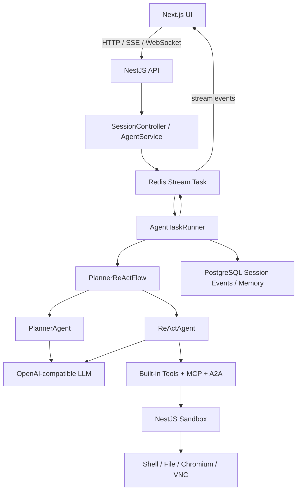
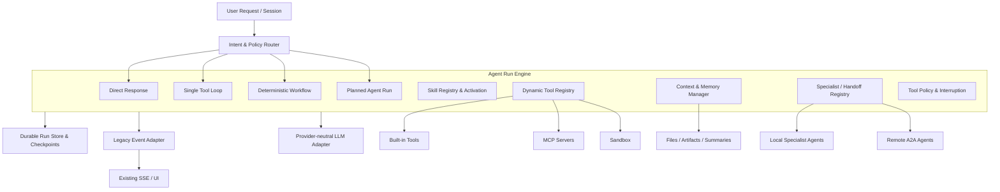
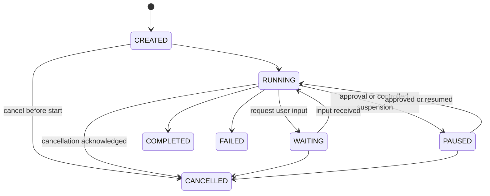

# Manus Agent 核心现代化 SDD

> 本文档只维护 Manus Agent 核心演进的目标设计和架构决策。任务状态、实施过程和会话交接位于 [Agent 核心现代化工作区](./agent-core-modernization/README.md)。

## 1. 文档控制

| 字段 | 值 |
| --- | --- |
| 文档状态 | Active |
| 文档版本 | 1.4 |
| 最后更新 | 2026-07-17 |
| 适用范围 | Agent Runtime、Skills、Tool/MCP、Memory/Context、Multi-Agent/A2A、Compatibility、Evaluation |
| 设计来源 | `docs/agent-core-modernization-sdd.md` |
| 进度来源 | `docs/agent-core-modernization/` |

### 1.1 总体目标

在保留 NestJS API、现有 LLM 抽象、UI、SSE、Redis Stream、PostgreSQL 和 Sandbox 的前提下，将当前固定的 Planner + ReAct 执行内核演进为供应商中立、可选择能力、可持久恢复、可渐进迁移的 Agent Runtime。

本设计不采用阶段式路线。Runtime、Skills、Tool/MCP、Memory/Context、Multi-Agent/A2A、Compatibility 和 Evaluation 是同级工作流，可以并行推进。只有任务表中显式声明的 `Dependencies` 才构成前置约束。

### 1.2 文档体系

- 架构设计与 ADR：本文档。
- 所有待办事项、任务状态与依赖：[总任务清单](./agent-core-modernization/TASKS.md)。
- 单任务工作记录：`docs/agent-core-modernization/tasks/<TASK-ID>/`。
- 工作区使用规则：[Agent 核心现代化工作区](./agent-core-modernization/README.md)。

任务状态、Evidence 和工作日志不再写入 SDD，避免设计文档随执行记录持续膨胀。跨会话续作直接读取对应任务目录的 `README.md` 和 `worklog.md`。

## 2. 当前架构基线（As-Is）

### 2.1 真实技术栈

- API 入口：[api/src/main.ts](../api/src/main.ts)
- Sandbox 入口：[sandbox/src/main.ts](../sandbox/src/main.ts)
- Agent 任务运行器：[api/src/domain/services/runtime/agent-task-runner.ts](../api/src/domain/services/runtime/agent-task-runner.ts)
- Planner + ReAct 流程：[api/src/domain/services/flows/planner-react-flow.ts](../api/src/domain/services/flows/planner-react-flow.ts)
- Agent 基类：[api/src/domain/services/agents/base-agent.ts](../api/src/domain/services/agents/base-agent.ts)
- Session 数据结构：[api/prisma/schema.prisma](../api/prisma/schema.prisma)

### 2.2 当前调用关系



### 2.3 当前值得保留的基础

- UI、API、Sandbox 分层清晰，适合继续独立演进。
- SSE 和 Redis Stream 已能持续传递 Plan、Step、Tool、Message、Wait、Error 和 Done 事件。
- PostgreSQL 已保存会话、事件、文件元数据和 Agent Memory。
- LLM、Browser、Search、Sandbox 和 File Storage 已有领域抽象。
- 内置工具、MCP 和 A2A 共用工具调用循环，具备统一入口的雏形。
- 已存在迭代上限、重试、单工具调用次数限制和用户等待事件。

### 2.4 当前核心问题

| 问题 | 当前表现 | 影响 |
| --- | --- | --- |
| 固定编排 | 所有请求都进入 Planner → ReAct → Update Plan → Summarize | 简单请求成本和延迟偏高，确定性流程也交给模型决定 |
| 工具全量披露 | `BaseAgent.getAvailableTools()` 在每次调用中返回完整工具集合 | MCP/工具数量增加后占用上下文，降低选择准确率 |
| 缺少 Skills | 没有 Skill 发现、目录披露、激活、资源加载和版本治理 | 流程知识只能硬编码在系统提示词或工具描述中 |
| 非耐久执行 | Session/Event 持久化，但流程节点和进行中的工具调用保存在进程内 | 进程重启后无法从精确节点恢复，副作用可能重复 |
| 取消不完整 | Task 取消标志无法稳定传播到正在执行的 LLM、MCP、A2A、浏览器或 Sandbox 请求 | UI 显示停止后，后台操作仍可能继续 |
| Memory 压缩较弱 | 主要删除部分浏览器结果和 reasoning 内容 | 长会话上下文继续增长，关键约束与无关历史没有结构化分离 |
| MCP 表层接入 | 主要使用 Tools，连接和工具列表在初始化时一次性加载 | `enabled`、动态刷新、Resources、Prompts、通知没有完整进入运行时 |
| A2A 表层接入 | 获取 Agent Card 后以单次请求调用远程 Agent | 缺少完整 Task、Artifact、Streaming、Cancel 和多轮上下文生命周期 |
| 缺少运行追踪与评测 | UI 可查看业务事件，但没有统一 Run/Span/成本/恢复指标 | 难以比较新旧内核，也难以发现质量回归 |

### 2.5 当前实现边界

- 根 Compose 默认通过 `SANDBOX_ADDRESS=sandbox` 使用常驻 Sandbox；Sandbox 隔离和多租户安全不属于本 SDD 的实施范围。
- 当前 Agent 使用 OpenAI-compatible Chat Completions 接口；目标设计保持供应商中立，不要求立即切换特定厂商 API。
- 当前 `Session.events` 和 `Session.memories` 使用 JSON 字段。目标 Run/Checkpoint 不继续无限堆入该字段，而使用明确的持久化模型。
- 当前前端依赖既有 Event 联合类型。新运行时必须先通过 Event Adapter 兼容它。

## 3. 目标、非目标与原则

### 3.1 目标

1. 根据任务特征选择 Direct Response、Single Tool、Deterministic Workflow 或 Planned Agent Run。
2. 支持 Agent Skills 开放格式，按目录、指令、资源三个层次渐进披露。
3. 只向模型暴露当前任务真正需要的工具和远程能力。
4. 将 Run、Step、ToolCall、Checkpoint 和 Interruption 建模并持久化。
5. 支持崩溃恢复、等待用户、待审批暂停、真实取消和副作用幂等。
6. 将 Run State、Conversation Memory、Working Context 和 Artifact 分离。
7. 明确 Manager、Agent-as-Tool、Handoff、Skill 和 A2A 的使用边界。
8. 保持现有 Session API、SSE 事件和 UI 在迁移期可用。
9. 用固定评测集比较任务完成率、成本、延迟、工具选择和恢复能力。

### 3.2 非目标

- 本 SDD 不设计完整的用户鉴权、RBAC 和多租户数据隔离。
- 本 SDD 不设计 Sandbox 的 seccomp、capability、网络出口和容器集群调度。
- 本 SDD 不建设基础设施高可用、集中日志平台或运维控制台。
- 本 SDD 不进行大规模前端视觉或信息架构重构。
- 本 SDD 不引入向量数据库、自动用户画像或跨会话长期知识提取。
- 本 SDD 不要求一次性替换所有旧 Agent 代码。

### 3.3 设计原则

- **供应商中立**：领域层不暴露特定厂商的 Agent 类型；厂商能力由适配器实现。
- **确定性优先**：能由代码稳定表达的流程不交给 LLM 自由规划。
- **最小能力披露**：模型只看到当前路径需要的 Skills、Tools 和 Agent。
- **状态与上下文分离**：业务执行状态不能只存在于聊天消息中。
- **副作用可识别**：每个外部写操作必须有风险分类、幂等键和可追踪结果。
- **可暂停和恢复**：用户输入、审批、进程重启都不要求重放整段对话。
- **兼容迁移**：新运行时先适配现有 API/Event，再逐步启用。
- **评测驱动**：新抽象必须用固定案例证明收益，不能只依赖主观体验。
- **工作流同级**：本文档中的工作流没有默认优先级或隐式执行顺序。

## 4. 概念边界

| 概念 | 定义 | 何时使用 | 不负责什么 |
| --- | --- | --- | --- |
| Workflow | 由代码定义的确定性节点与转换 | 路径、检查点和副作用可预先确定 | 不承担开放式自主规划 |
| Agent | 拥有独立指令、模型策略、状态或会话所有权的执行者 | 需要自治判断或独立专业上下文 | 不作为普通流程说明的容器 |
| Skill | 可移植的任务说明、流程知识、脚本和资源包 | 复用团队做事方法或领域流程 | 不自动获得独立会话或模型 |
| Tool | 具有结构化输入输出的可执行能力 | 读取数据、操作外部系统或产生 Artifact | 不包含完整任务编排策略 |
| MCP | 外部 Tools、Resources、Prompts 等能力的标准接入协议 | 连接外部服务和上下文 | 不等价于多 Agent 协作 |
| A2A | 与外部自治 Agent 交换 Task、Message 和 Artifact 的协议 | 跨系统委派长任务 | 不作为内部函数调用的默认替代 |
| Run State | 当前执行节点、状态、重试、暂停和恢复信息 | 驱动可靠执行 | 不直接作为 LLM 聊天历史 |
| Conversation Memory | 会话中用户与 Agent 的语义历史 | 保持多轮对话连续性 | 不保存精确执行游标 |
| Working Context | 某次模型调用实际选入的指令、消息、Skill、证据和摘要 | 控制上下文质量和预算 | 不作为永久事实库 |

判断规则：可复用流程默认先做 Skill；需要确定性控制时做 Workflow；只有需要独立模型、独立状态、独立工具边界或会话所有权时才做 Agent。

## 5. 目标架构（To-Be）



### 5.1 请求路由

路由类型固定为：

```ts
type RouteKind = 'direct' | 'single_tool' | 'workflow' | 'planned_agent';

type RouteDecision = {
  route: RouteKind;
  reason: string;
  requiredCapabilities: string[];
  requestedSkills: string[];
  workflowName?: string;
  confidence: number;
};
```

路由顺序：

1. 用户显式指定 Skill、Workflow 或 Agent 时，先验证其存在和权限，再优先采用。
2. 代码规则识别确定性请求，例如仅查看 Session、固定格式转换或已注册 Workflow。
3. 无确定性匹配时调用轻量路由模型输出 `RouteDecision`。
4. 路由输出必须通过 Zod 校验；校验失败或置信度不足时回退到 `planned_agent`，以保持与旧行为接近。
5. 路由本身不得执行有副作用的工具。

各路径语义：

- `direct`：不调用外部工具，直接生成回答。
- `single_tool`：限定一个主要工具调用，随后生成结果；失败时按工具策略决定是否重试。
- `workflow`：运行已注册的代码节点，只有指定节点可以调用模型。
- `planned_agent`：适用于开放复杂任务，允许计划、工具循环、计划调整和总结。

### 5.2 Run 数据模型

目标实现使用明确的 Prisma 模型或等价仓储，不继续将全部运行状态写入 `Session.events`：

```ts
type AgentRun = {
  id: string;
  sessionId: string;
  route: RouteKind;
  status: RunStatus;
  currentNode: string | null;
  version: number;
  cancelRequestedAt: Date | null;
  startedAt: Date | null;
  completedAt: Date | null;
  error: string | null;
  metadata: Record<string, unknown>;
};

type RunStep = {
  id: string;
  runId: string;
  key: string;
  kind: 'model' | 'tool' | 'workflow' | 'handoff' | 'summary';
  status: RunStepStatus;
  attempt: number;
  input: unknown;
  output: unknown;
  error: string | null;
};

type ToolCallRecord = {
  id: string;
  runId: string;
  stepId: string;
  toolName: string;
  arguments: unknown;
  result: unknown;
  status: ToolCallStatus;
  risk: ToolRisk;
  idempotencyKey: string;
  requestFingerprint: string;
  startedAt: Date | null;
  completedAt: Date | null;
};

type Checkpoint = {
  id: string;
  runId: string;
  sequence: number;
  resumeNode: string;
  nextEventSequence: number;
  state: Record<string, unknown>;
  createdAt: Date;
};

type Interruption = {
  id: string;
  runId: string;
  kind: 'user_input' | 'approval';
  status: 'pending' | 'resolved' | 'rejected' | 'expired';
  payload: Record<string, unknown>;
  resolution: Record<string, unknown> | null;
};
```

状态枚举使用稳定的小写持久化值：

- `RunStatus`：`created`、`running`、`waiting`、`paused`、`completed`、`failed`、`cancelled`。
- `RunStepStatus`：`pending`、`running`、`completed`、`failed`、`cancelled`。
- `ToolCallStatus`：`pending`、`running`、`completed`、`failed`、`cancelled`、`unknown`；`unknown` 表示副作用是否完成暂时无法确认。
- `ToolRisk`：`read`、`write`、`destructive`、`external_communication`。
- `InterruptionStatus`：`pending`、`resolved`、`rejected`、`expired`。
- `CancellationOutcome`：`confirmed`、`timed_out`；超时确认必须同时记录无法确认的活动操作。

创建工厂只产生初始状态：Run=`created`、Step/ToolCall/Interruption=`pending`。从持久化数据恢复实体时必须走独立的校验映射，不能借创建工厂跳过生命周期约束。

Checkpoint 字段语义固定为：

- `sequence` 是单个 Run 内从 0 开始、逐次加 1 的 Checkpoint 序号；`(runId, sequence)` 唯一。
- `resumeNode` 是恢复后要执行的精确下一节点，不是最后完成的节点。
- `nextEventSequence` 是恢复后要分配给下一个 Runtime Event 的非负序号，避免“尚无事件”与事件 0 混淆。

领域仓储以 `AgentRun` 为聚合根，并遵守以下契约：

- 创建、按 ID 查询、按 Session 查询和更新 Run；更新必须携带 `expectedVersion`。
- Run 更新原子匹配当前版本并将版本递增一次；不存在、版本冲突和非法状态变化必须返回可区分结果，禁止静默覆盖。
- Step、ToolCall 和 Interruption 可创建、更新及按 Run 查询；Checkpoint 只追加，不原地覆盖。
- 恢复查询必须能取得最新 Checkpoint、未完成 ToolCall 和待处理 Interruption。
- ToolCall 的 `(runId, idempotencyKey)` 必须唯一；仓储提供原子的 reserve-or-get，而不是先查后建。
- ToolCall 使用稳定的 `requestFingerprint` 标识规范化后的工具名和参数；同一幂等键只有在指纹一致时才可复用，否则返回键冲突。
- Step、ToolCall 和 Interruption 的状态更新必须携带预期状态并显式返回冲突，避免迟到写入覆盖新状态。
- Checkpoint 追加必须原子校验下一个序号；`already_exists` 只表示所有字段完全相同的幂等重试，同序号内容不同或 `nextEventSequence` 回退必须返回冲突。
- 同一次聚合变更中的 Run 条件更新和子记录写入必须在一个 UnitOfWork 事务内提交；Run 冲突时整体回滚。
- RUNTIME-101 只定义领域端口；Prisma 模型、迁移、实现和 UnitOfWork 接线由 RUNTIME-102 完成。

### 5.3 运行状态机



约束：

- `COMPLETED`、`FAILED`、`CANCELLED` 是终态。
- 状态更新使用版本号进行乐观并发控制。
- 领域状态转换是纯函数：转换时间和失败原因等输入必须由调用方显式提供；转换不自行递增持久化版本，仓储成功执行带 `expectedVersion` 的条件更新时原子递增版本并返回新快照。
- `FAILED` 必须有非空错误；其他状态的 `error` 必须为 `null`。
- `cancelRequestedAt` 只是取消请求，不等于已经终止；执行器确认所有活动操作停止后才能进入 `CANCELLED`。
- 进入 `CANCELLED` 前必须已有取消请求，并提供 `confirmed` 或 `timed_out` 确认；超时确认需把无法确认的活动操作写入 metadata。
- 恢复时从最后一个已提交 Checkpoint 的 `resumeNode` 继续。
- 不承诺外部系统绝对 exactly-once；通过幂等键、调用记录和结果复用实现可验证的 at-least-once 安全。

### 5.4 Checkpoint 与恢复

必须写 Checkpoint 的位置：

- 路由完成后。
- 每个 RunStep 开始前和完成后。
- 有副作用工具调用提交前和结果持久化后。
- 进入 `WAITING` 或 `PAUSED` 前。
- Handoff 前后。
- 进入任一终态前。

恢复算法：

1. 获取 Run 最新 Checkpoint 和未完成 ToolCallRecord。
2. 对已成功并持久化结果的工具调用直接复用结果。
3. 对状态未知的副作用调用先查询外部结果；无法确认时进入 `PAUSED`，不得盲目重放。
4. 重建已激活 Skills、Working Context 摘要、Agent 所有权和待处理中断。
5. 从 Checkpoint 的 `resumeNode` 继续，并用 `nextEventSequence` 分配下一事件序号，保持事件 `sequence` 单调递增。

### 5.5 取消传播

API 接到停止请求后：

1. 原子写入 `cancelRequestedAt`。
2. 触发该 Run 的根 `AbortController`。
3. 将 `AbortSignal` 传递给 LLM、Tool Registry、MCP、A2A、Browser、Search 和 Sandbox 适配器。
4. 不再调度新 Step 或 ToolCall。
5. 等待活动操作确认终止；超时后记录无法确认的操作并进入 `CANCELLED`，同时保留告警元数据。
6. Event Adapter 输出兼容的 `done`，并通过可选 `metadata.terminal_status` 区分完成与取消。

### 5.6 结构化输出

- 领域层用 Zod 定义 Route、Plan、Step、Agent Result 和 Handoff Payload。
- Provider 支持 JSON Schema/Structured Output 时优先使用严格 Schema。
- 只支持 JSON Object 时，使用 JSON mode + Zod 校验。
- 校验失败最多进行两次带具体错误信息的修复重试。
- 修复失败后将当前 Step 标记 `FAILED`，不得用空对象或猜测值继续。
- `jsonrepair` 只能修复语法，不得绕过 Schema 语义校验。

## 6. Skills 设计

### 6.1 目录格式

项目级 Skills 位于：

```text
.agents/skills/<skill-name>/
├── SKILL.md
├── scripts/
├── references/
└── assets/
```

首个实现只扫描项目级 `.agents/skills/`。用户级、组织级和远程 Skill Registry 不在首个实现范围内。

### 6.2 SKILL.md 契约

```yaml
---
name: web-research
description: 进行来源驱动的网页研究和事实核查。用于需要最新信息、引用或多来源比较的任务。
compatibility: Requires browser or search tools and network access.
metadata:
  version: "1.0.0"
  owner: "manus"
allowed-tools: search_web browser_navigate browser_view
---
```

规则：

- `name`、`description` 必填，并遵循 Agent Skills 命名约束。
- `name` 必须与目录名一致。
- `description` 是模型选择 Skill 的主要依据，应同时说明能力和触发场景。
- `compatibility`、`metadata`、`allowed-tools` 可选。
- 单个 `SKILL.md` 默认最大 256 KiB；超限 Skill 不进入目录并记录诊断。
- Skill 目录中的所有文件访问都必须经过真实路径校验，禁止 `..`、符号链接逃逸和绝对路径逃逸。
- 重名 Skill 视为配置错误；不得静默覆盖。

### 6.3 渐进式披露

1. **Catalog**：Run 初始化时只向模型提供 `name`、`description` 和稳定 Skill ID。
2. **Activation**：用户显式指定或模型判定相关时，由运行时内部能力激活完整 `SKILL.md`。
3. **Resources**：只有 Skill 指令引用具体脚本、参考资料或资产时才读取相应文件。

激活约束：

- 同一个 Skill 在单个 Run 内最多激活一次，后续请求返回已有激活记录。
- 激活内容属于受保护上下文，普通 Memory Compaction 不得删除。
- Skill 不能通过正文自行扩大工具权限。
- `allowed-tools` 存在时是该 Skill 可请求工具的上限；最终工具集合为路由候选、Skill 声明和运行时 Policy 的交集。
- 未声明 `allowed-tools` 不代表允许所有工具，也不会自动增加本轮工具。
- scripts 不得自动执行；必须通过 Sandbox Tool 形成可追踪 ToolCallRecord。

### 6.4 Skill 错误处理

- YAML 或字段校验失败：隔离该 Skill，其他 Skills 继续可用。
- 资源不存在：本次 Skill 操作失败并向模型返回明确错误，不让整个 Registry 崩溃。
- 资源超限：保存为诊断事件，不将内容直接注入模型。
- 脚本失败：按普通 ToolCall 记录退出码、stdout/stderr 和 Artifact。
- Skill 更新：新 Run 使用新版本；已运行中的 Run 继续使用激活时记录的版本和内容摘要。

## 7. Tool 与 MCP 设计

### 7.1 Tool Registry

统一描述结构：

```ts
type ToolDescriptor = {
  id: string;
  name: string;
  source: 'builtin' | 'mcp' | 'agent';
  description: string;
  inputSchema: Record<string, unknown>;
  capabilities: string[];
  risk: 'read' | 'write' | 'destructive' | 'external_communication';
  requiresApproval: boolean;
  timeoutMs: number;
};
```

工具选择流程：

1. Router 输出所需 capabilities。
2. Workflow 或当前 Agent 提供允许的工具范围。
3. 已激活 Skills 可以进一步收窄或请求其中的工具。
4. Policy 根据风险和运行上下文移除禁止工具或创建审批 Interruption。
5. 只有最终集合的 Schema 被传给模型。

### 7.2 统一调用规则

- 默认超时为 60 秒；明确声明为长任务的工具可以配置到 10 分钟。
- 只有只读、幂等工具可以自动重试，最多两次。
- 写入、破坏性和外部通信工具不得无条件自动重试，除非适配器支持幂等键。
- 工具结果统一为 `success/data/error/metadata`，不得同时用成功状态包装业务错误。
- 内联返回给模型的结果默认不超过 128 KiB；更大结果保存为 Artifact，只返回摘要和引用。
- 所有工具必须接受 `AbortSignal`，即使底层暂时无法中止，也必须停止后续结果消费并记录限制。

### 7.3 MCP

- 只连接 `enabled: true` 的服务器。
- 工具名称继续使用服务器前缀，避免跨服务器碰撞。
- 单个 MCP 服务器连接失败时隔离故障，不阻止其他服务器和内置工具启动。
- 支持工具列表缓存失效和服务端能力变化通知；无法订阅时允许按配置刷新。
- Tools 是首要兼容能力；Resources、Prompts 和 Notifications 作为同级任务独立实施。
- MCP Resources 进入 Context Manager，不伪装成可执行 Tool。
- MCP Prompts 作为可选择模板，不覆盖系统级安全指令。
- MCP 远程连接认证由配置适配器提供；密钥不得写入事件或模型上下文。

## 8. Memory 与 Context 设计

### 8.1 四类数据

| 类型 | 保存内容 | 生命周期 | 是否直接进入模型 |
| --- | --- | --- | --- |
| Run State | 节点、状态、重试、激活 Skill、待处理中断 | 单个 Run | 否，由运行时选择性映射 |
| Conversation Memory | 用户/助手语义消息和必要工具摘要 | Session | 是，受预算限制 |
| Working Context | 本次调用选择的系统指令、Skill、近期消息、摘要和证据 | 单次模型调用 | 是 |
| Artifact | 文件、大型工具结果、截图、结构化数据 | Session/存储策略 | 只注入摘要和引用 |

### 8.2 上下文预算

- 为输出、工具调用和模型推理预留至少 25% 的模型上下文窗口。
- Working Context 的输入预算不得超过可用窗口的 75%。
- 系统指令、Policy、当前用户请求、已激活 Skill 核心指令和未完成任务状态属于受保护内容。
- 近期消息优先于早期原始消息；早期内容通过结构化摘要保留。
- 大型 Tool Result、网页正文和文件内容默认保存为 Artifact，仅按需读取相关片段。
- 预计超出预算时在调用模型前压缩，不能依赖供应商返回超限错误后再补救。

### 8.3 结构化摘要

摘要至少包含：

```ts
type MemorySummary = {
  userGoal: string;
  constraints: string[];
  confirmedFacts: Array<{ fact: string; source?: string }>;
  decisions: string[];
  completedWork: string[];
  pendingWork: string[];
  activeSkills: Array<{ name: string; version: string }>;
  artifacts: Array<{ id: string; description: string }>;
};
```

摘要不得把未验证推测升级为 confirmedFacts。摘要更新后保留来源消息范围和生成时间，以便调试与重建。

## 9. Multi-Agent 与 A2A 设计

### 9.1 Specialist Agent Registry

```ts
type AgentDescriptor = {
  id: string;
  name: string;
  description: string;
  capabilities: string[];
  instructions: string;
  allowedTools: string[];
  defaultSkills: string[];
  modelPolicy: string;
};
```

### 9.2 Agent-as-Tool

- Manager 保持当前会话所有权和最终答复责任。
- Specialist 接受有边界的任务、输入 Artifact 引用和期望输出 Schema。
- Specialist 返回结构化结果，不直接向用户输出消息。
- Manager 可以组合多个 Specialist 结果。
- 只有相互独立的子任务可以并行；默认最大并发数为 3，并可通过配置收紧。

### 9.3 Handoff

- Handoff 用于 Specialist 应直接接管后续对话的场景。
- Handoff 不创建新的 Session，但在同一 Run 内更新 activeAgentId。
- 传递内容必须经过 Context Filter，只包含用户目标、必要历史、Artifact 和未完成状态。
- Handoff 前后写 Checkpoint，并产生可追踪事件。
- 接管 Agent 的输出仍通过 Event Adapter 进入现有 UI。

### 9.4 A2A

- A2A 只用于外部自治 Agent，不替代内部普通函数或 Skill。
- 采用当前 A2A 规范的数据模型和方法，支持 Agent Card、Message、Task、Artifact、Streaming、Cancel 和多轮上下文。
- 远程 Task ID、Context ID 和本地 Run/Step 建立持久映射。
- 远程 Agent 请求输入时，转换为本地 Interruption。
- 远程 Artifact 进入本地 Artifact 流程，不直接拼入聊天字符串。
- 远程取消结果不明确时保留状态并告警，不将本地任务伪装为已安全终止。

## 10. Compatibility 设计

### 10.1 现有接口保持

- 现有 Session 创建、聊天、停止、流式读取、文件和 Shell API 在迁移期保持可用。
- 现有 `plan`、`step`、`tool`、`message`、`wait`、`error`、`done` 事件保持语义。
- 新字段只能先以可选字段加入：`run_id`、`sequence`、`checkpoint_id`、`metadata`。
- Event Adapter 负责把 Runtime Event 映射为 Session Event，领域执行器不直接依赖 UI 类型。
- `sequence` 在单个 Run 内单调递增，用于断线恢复和去重。

### 10.2 正式运行入口

- `AgentTaskRunner` 只通过 `RuntimeService` 执行消息，不提供内核运行模式开关。
- Router 为每个请求选择 Direct、Single Tool、Workflow 或 Planned Agent。
- Planned Agent 内部复用 `PlannerReActFlow`，它是正式执行器实现，不是独立入口。
- Runtime Event 经 Event Adapter 转换成 Session Event，现有 API、SSE 和 UI 协议保持不变。

### 10.3 回滚

任一条件满足时回滚到上一个可用部署版本：

- Event 契约测试失败。
- 出现重复副作用或 Checkpoint 恢复错误。
- 取消后仍继续调度新工具。
- 核心评测完成率显著低于基线。
- Runtime 导致无法读取既有 Session。

回滚不得依赖已删除的内核分支；使用镜像或提交版本回退，并保留数据库迁移恢复说明。

## 11. Evaluation 设计

### 11.1 固定任务集

至少覆盖：

- 不需要工具的简单问答。
- 只需一个工具的查询。
- 需要多个来源的复杂研究。
- 文件读取、生成和 Artifact 返回。
- 需要用户补充信息并恢复。
- LLM 超时、工具超时、MCP 断连。
- 进程在 Step 前、工具提交后和结果持久化后崩溃。
- 用户在 LLM、Shell、Browser 和 A2A 执行中取消。
- Skill 正确触发、错误触发、缺少资源和权限不足。
- Manager 调用 Specialist、Handoff 和远程 A2A 多轮任务。

### 11.2 指标

| 指标 | 说明 |
| --- | --- |
| Task Success Rate | 是否满足任务验收结果 |
| Tool Selection Accuracy | 是否选择必要且最小的工具集合 |
| Skill Activation Precision/Recall | Skill 是否正确触发且不过度触发 |
| Model Calls | 单任务模型调用次数 |
| Tool Calls | 单任务工具调用次数和重复率 |
| Token Usage | 输入、输出和总 Token |
| Latency | 总耗时及各节点耗时 |
| Recovery Success | 故障后是否从正确 Checkpoint 恢复 |
| Cancellation Latency | 停止请求到不再执行外部操作的时间 |
| Duplicate Side Effects | 故障恢复后重复外部写操作数量 |

### 11.3 Runtime 发布门槛

- 既有 API/Event 契约测试 100% 通过。
- 固定任务集完成率不低于既有发布基线。
- 故障注入中的可恢复案例 100% 从预期节点继续。
- 重复副作用数量为 0。
- 取消后不得调度新的 ToolCall。
- Direct 和 Single Tool 路径的 P95 延迟不得比既有发布基线高 15% 以上。
- Planned Agent 路径的 P95 延迟不得比既有发布基线高 20% 以上，除非完成率有记录充分的提升。
- Skills 触发与 Tool 选择专项评测达到任务中约定的样本门槛。

## 12. 任务与进度记录

所有工作流仍处于同一级别，任务顺序和依赖统一维护在 [总任务清单](./agent-core-modernization/TASKS.md)。每个开始实施的任务创建独立 `tasks/<TASK-ID>/` 工作目录，分别记录任务状态、工作过程和验证证据。

## 13. 架构决策记录（ADR）

| ID | Status | 决策 | 理由 | 结果与约束 | 日期 |
| --- | --- | --- | --- | --- | --- |
| ADR-001 | Accepted | 保留 NestJS，自研供应商中立 Agent Runtime | 当前领域抽象和部署结构可复用，避免绑定单一模型厂商 | 可参考现有框架模式，但领域类型不得依赖厂商 SDK | 2026-07-16 |
| ADR-002 | Accepted | 迁移期保持 Session API 和 SSE Event 兼容 | UI 和数据流已经可用，先替换内核能降低范围和风险 | 新字段先可选加入；通过 Event Adapter 隔离 | 2026-07-16 |
| ADR-003 | Accepted | Skills 采用 Agent Skills 开放格式 | 便于跨客户端复用并支持渐进式披露 | 首个实现只扫描 `.agents/skills/` 项目目录 | 2026-07-16 |
| ADR-004 | Superseded | 使用运行模式开关渐进迁移 | Runtime 已正式化为唯一入口 | 由 ADR-012 取代 | 2026-07-16 |
| ADR-005 | Accepted | 所有工作流同级，不设置实施阶段 | 各能力可以独立或并行推进 | 只有任务表 Dependencies 构成前置关系 | 2026-07-16 |
| ADR-006 | Accepted | Skill 默认不是 Agent | 流程知识不需要独立模型和会话状态 | 只有独立模型、状态、工具或所有权边界才创建 Agent | 2026-07-16 |
| ADR-007 | Accepted | Run State、Conversation Memory、Working Context 和 Artifact 分离 | 当前消息列表同时承担过多职责 | 每类数据使用独立生命周期和进入模型规则 | 2026-07-16 |
| ADR-008 | Accepted | 依赖关系只在任务级显式表达 | 避免文档章节或列表顺序造成虚假依赖 | 无依赖的 `ready` 任务可直接领取 | 2026-07-16 |
| ADR-009 | Accepted | 设计文档与执行记录分离 | 单一 SDD 同时维护设计、任务和会话日志会持续膨胀 | SDD 只维护设计和 ADR；任务执行记录进入独立工作区 | 2026-07-16 |
| ADR-010 | Accepted | 总清单使用单一 Markdown，已启动任务使用独立目录 | 用户需要先看到完整待办，再按任务持续积累工作过程 | `TASKS.md` 是总清单；`tasks/<TASK-ID>/` 包含任务首页、worklog 和 evidence | 2026-07-16 |
| ADR-011 | Accepted | 不单独维护 Session Handoff 目录 | 每个任务已有持续 worklog 和 Current State，独立 Handoff 会重复记录 | 跨会话续作直接读取任务目录；没有已启动任务时无需创建交接记录 | 2026-07-16 |
| ADR-012 | Accepted | Runtime 是唯一消息执行入口 | 双入口增加配置、测试和运行分歧，且正式 Runtime 已通过会话链路验证 | 删除运行模式开关；Planned Agent 保留 `PlannerReActFlow` 作为内部实现；回滚使用部署版本 | 2026-07-18 |

新增 ADR 时使用以下格式：

```markdown
### ADR-XXX：标题

- Status: Proposed | Accepted | Superseded | Rejected
- Date: YYYY-MM-DD
- Context: 需要解决的约束或冲突
- Decision: 明确且唯一的决定
- Consequences: 正面影响、代价和后续约束
- Supersedes: 可选，被替代的 ADR
```

## 14. 风险与失败处理总表

| 风险 | 预防 | 运行时处理 | 必要验证 |
| --- | --- | --- | --- |
| Router 错误选择简单路径 | Schema 校验、能力检查、低置信回退 | 升级到 planned_agent，不重复已完成副作用 | 路由正反例评测 |
| Checkpoint 与外部副作用不一致 | 调用前后记录、幂等键 | 查询外部状态；未知时暂停人工确认 | 故障注入 |
| Skill 内容恶意或错误 | 项目级信任边界、路径/大小/字段校验 | 隔离单个 Skill，记录诊断 | 路径逃逸与错误 YAML 测试 |
| 工具结果过大 | 结果阈值和 Artifact 化 | 返回摘要与引用 | 大文件/网页测试 |
| MCP 单服务故障 | 连接隔离和超时 | 移除该服务本轮工具，其他能力继续 | 断连测试 |
| A2A 任务长期无响应 | 超时、订阅和本地状态映射 | 保留远程 Task ID，可取消或恢复订阅 | 流中断测试 |
| Memory 摘要失真 | 结构化字段和来源范围 | 不把未确认内容写入 confirmedFacts | 长会话回归集 |
| Handoff 泄漏无关上下文 | Context Filter | 阻止转移并记录错误 | 上下文边界测试 |
| 重复写操作 | Checkpoint、幂等键和调用状态 | 检查外部状态；未知时暂停人工确认 | 风险分类与故障注入测试 |

## 15. 参考资料

- [Agent Skills Specification](https://agentskills.io/specification)
- [Adding Skills Support to an Agent](https://agentskills.io/client-implementation/adding-skills-support)
- [Model Context Protocol Architecture](https://modelcontextprotocol.io/docs/learn/architecture)
- [A2A Protocol Specification](https://github.com/a2aproject/A2A/blob/main/docs/specification.md)
- [OpenAI Agents SDK: Agent Orchestration](https://openai.github.io/openai-agents-js/guides/multi-agent/)
- [OpenAI Agents SDK: Human in the Loop](https://openai.github.io/openai-agents-js/guides/human-in-the-loop/)
- [LangGraph Persistence](https://docs.langchain.com/oss/python/langgraph/persistence)

这些资料用于借鉴设计模式和开放协议，不表示 Manus 必须采用对应框架。

## 16. 变更日志

| 日期 | 版本 | 变更 | 相关任务/ADR |
| --- | --- | --- | --- |
| 2026-07-17 | 1.4 | 明确运行实体状态枚举、纯状态转换与带版本条件更新的仓储契约 | RUNTIME-101、ADR-001、ADR-007 |
| 2026-07-16 | 1.3 | 删除重复的 Handoff 文件体系，跨会话过程统一记录在任务目录 | ADR-011 |
| 2026-07-16 | 1.2 | 将进度体系调整为单一 `TASKS.md` 总清单，并为每个已启动任务创建独立工作目录 | ADR-010 |
| 2026-07-16 | 1.1 | 将任务索引、单任务日志和 Session Handoff 迁移到独立工作目录，SDD 只保留目标设计和 ADR | ADR-009 |
| 2026-07-16 | 1.0 | 建立 Agent 核心现代化 SDD、同级工作流任务池、目标架构和治理规则 | ADR-001 至 ADR-008 |
